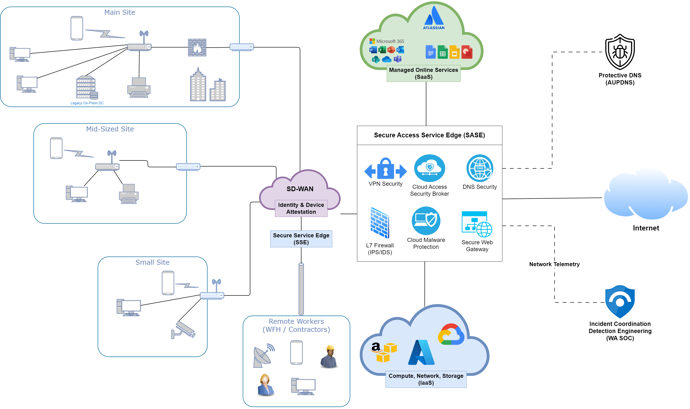

# Network Management Guideline

This guideline is intended to define a pragmatic target for an entities network architecture to enable effective network management with modern tooling. This guide is structured around the [use cases for a complex network](#common-network-use-cases) with a design that can be adopted incrementally based on an agencies requirements.

## Contemporary Network Architecture

Organisations should strive to reduce network complexity and focus on the key outcome of connecting staff to systems securely. They should mitigate risks as much as possible by favouring managed cloud services with segregated control planes (as opposed to local direct management and the associated privileged access / shared credential complexity) and steering clear of legacy technologies such as direct Layer 3 network access.

### Remote Access for staff and vendors

It's strongly recommended to transition from traditional VPNs to Modern Secure Service Edge (SSE) technology, that can also improve the application of network policies across an organisation. SSE and SASE technologies are available from:

- Infrastructure providers ([Microsoft Global Secure Access](https://learn.microsoft.com/en-us/azure/global-secure-access/overview-what-is-global-secure-access), [VMWare SASE](https://sase.vmware.com/sd-wan/security-services))
- Network hardware vendors ([Check Point Harmony Connect](https://www.checkpoint.com/harmony/connect-sase/), [Cisco Secure Access](https://www.cisco.com/site/us/en/products/security/secure-access/index.html), [FortiSASE](https://www.fortinet.com/products/sase),  [Palo Alto Prisma SASE](https://www.paloaltonetworks.com/sase/access))
- Virtual network vendors ([Claroty SRA](https://claroty.com/industrial-cybersecurity/sra), [Netskope SASE](https://www.netskope.com/solutions/secure-access-service-edge), [Zscaler SASE](https://www.zscaler.com/capabilities/secure-access-service-edge))

These technologies all incorporate zero trust and policy-based access logging and management out of the box and are strongly recommended for where direct network access to legacy systems is still required.

## Observability & Manageability

Network security and management becomes much more effective once administrators have visibility over [useful logs](https://soc.cyber.wa.gov.au/guidelines/further-five/#implementation-guidance-leveraging-network-related-logs)(baseline network activity, app & user identification, DNS, NetFlow data, firewall logs, HTTP/HTTPS sessions, etc). Having the ability to tie logs to specific apps and users both improves network segmentation capabilities and quality of log data for investigation and observation purposes. Most telco's have effective SD-WAN management capabilities ( [Aussie Broadband](https://www.aussiebroadband.com.au/enterprise/network/sd-wan/), [Optus](https://www.optus.com.au/enterprise/networking/network-connectivity/fusion-sd-wan), [Telstra](https://www.telstra.com.au/business-enterprise/products/networks/sdn/sd-wan), [TPG](https://www.tpgtelecom.com.au/business-solutions/sd-wan), [Vocus](https://www.vocus.com.au/enterprise/connectivity/managed-network-services/sd-wan) ), while still allowing an organisation read-only access for capacity and security management functions. Organisations with the requirement and capability to manage network equipment should look towards using modern hardware with a secure cloud control plane ( [Cisco DNA Center (including meraki)](https://www.cisco.com/c/en/us/products/collateral/cloud-systems-management/dna-center/nb-06-dna-center-data-sheet-cte-en.html), [Forticloud](https://www.fortinet.com/content/dam/fortinet/assets/data-sheets/FortiCloud.pdf) ) that enable simple device management and telemetry access for all gateways, routers, switches and access points.

## Adverse Event Analysis

Maintaining an up to date asset inventory and monitoring baseline activity enable network anomaly detection. Most if not all the products mentioned in this guideline have some capability for continuous threat detection and monitoring, real-time detection and response, or at the very least log forwarding options that can allow you SIEM to ingest data and perform alerting based on SIEM rules. The below tools notably provide tunable detection analytics linked into basic case management for security operations.

- Cisco [Secure Network Analytics](https://www.cisco.com/c/en/us/products/collateral/security/stealthwatch/datasheet-c78-739398.html) - [Cisco XDR](https://www.cisco.com/site/au/en/products/security/xdr/index.html)
- Palo Alto [Prisma Cloud](https://www.paloaltonetworks.com/prisma/cloud/cloud-network-security) - [Cortex XDR](https://www.paloaltonetworks.com/engage/cortex-extended-detection-and-response/cortex-xdr-datasheet)
- Check Point [CloudGuard](https://www.checkpoint.com/cloudguard/) - [Horizon NDR](https://www.checkpoint.com/horizon/ndr/)
- Fortinet - [FortiNDR](https://www.fortinet.com/content/dam/fortinet/assets/solution-guides/sb-fortindr.pdf)

## Segmentation

Modern [network segmentation](https://soc.cyber.wa.gov.au/guidelines/further-five/#network-segmentation) helps prevent lateral movement of adversaries in an organisation and allows effective isolation/containment when responding to breaches. Through good use of network segmentation agencies can prevent certain devices or groups of devices from ever communicating with each other to adhere with principles of least privilege and protect critical infrastructure or sensitive systems. Modern SSE technologies such as those mentioned above can implement tag-based network segmentation across a broad enterprise SD-WAN including public cloud assets with appropriate egress flow monitoring. Additionally the ongoing traffic analytics from central control planes enable rapid analysis and understanding of common network flows, to simplify ongoing firewall policy management and security improvements.

Response actions may also require rapid isolation of sections of the network - a separate secure control plane (as is standard with SD-WAN and SASE architectures) with the ability to rapidly enact policy, physical and logical management boundaries between networks makes this much simpler to implement rapidly when required.

## Common Network Use Cases

- [ ] End Users working flexibly (baseline) - includes users at home/work/offsite accessing resources over the internet
- [ ] Collaborative technologies (Email, Telephony, Video Conferencing, Filesharing)
- [ ] Local access to office resources
- [ ] Remote access to business systems that don't support modern access protocols
- [ ] Remote access to servers (compute & storage) resources
- [ ] Operational Technology (OT) networks - all network connected devices without endpoint agents
    - Industrial Control Systems
    - Building Management Systems
    - Sector specific technology (Critical Infrastructure & Health)
    - Physical security systems (CCTV, Access Systems)
- [ ] Remote access to Operational Technology devices
